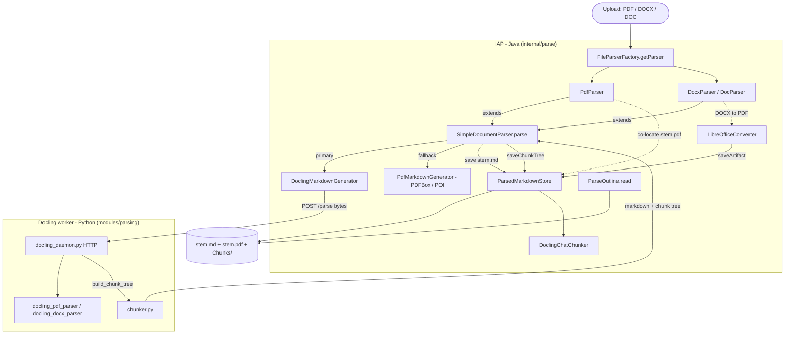
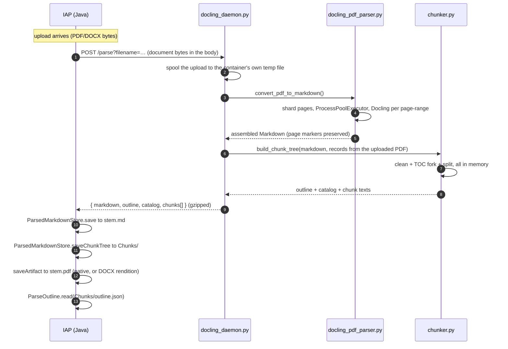
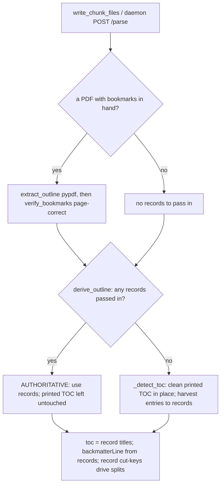

# Parsing Pipeline — How an upload becomes Markdown + chunks

A file (PDF / DOCX / DOC) is turned into one `<stem>.md` plus a `Chunks/` tree
(`outline.json`, and when the document is large enough `catalog.json` + `Chunk-*.md`). Two
sides cooperate: **IAP (Java)** orchestrates and owns the files; a **Docling worker
(Python)** does the heavy Markdown generation and all the chunking/outline logic.

- **Java**: `modules/documents/processing/src/main/java/io/iap/process/`
- **Python**: `modules/documents/processing/src/main/python/`

---

## Big picture — who calls what



**One round trip:** `POST /parse` takes the document bytes and returns the Markdown *and* the
chunk tree together. Java writes both. The daemon touches no filesystem of ours, which is what lets
it run in its own container — a path-based call cannot, because the caller's absolute paths do not
exist inside the container. Bookmarks are read from the uploaded PDF inside the same call, so the
outline still works without a co-located sibling file (see [Outline](#the-outline-subsystem)).

---

## The daemon flow, step by step



**There is no CLI fallback.** It was removed when the daemon moved into its own container:
running `docling_parser.py` as a subprocess needed Docling installed next to the JVM — the very
dependency the container removes — and it passed filesystem paths, which cannot cross a container
boundary.

If Docling fails or returns too little, `SimpleDocumentParser` falls back to the Java
**PDFBox/POI** generator, which needs nothing external. That fallback exists mainly for the case
where **Docling errors and produces no Markdown at all**, not for a daemon outage; in practice the
container is expected to be running.

The fallback produces Markdown but **no chunk tree** — chunking exists only in Python. So it writes
`Chunks/outline.json` with `chunked: false` and `unchunkedReason: "chunker_unavailable"`, which is
deliberately distinguishable from a document that is merely below the size gate (that one records
`unchunkedReason: "below_min_structure_tokens"`). Downstream must switch on that field: both are
unchunked, but only the second is a legitimate send-it-whole document.

### Planned: sequential windowing when no chunk tree exists — NOT IMPLEMENTED

`unchunkedReason: "chunker_unavailable"` currently has no special downstream handling. It is a rare
case: it needs Docling to have failed outright, or the daemon to be unreachable, and the document to
be too large to send whole.

The intended behaviour, **deferred past the MVP**:

> When a phase needs to send a document that has no chunk tree, split it into consecutive pieces
> sized to the **max chunk size from the active LLM configuration** and send them in sequence,
> continuing until every answer for that phase has been obtained — rather than sending the whole
> document and overflowing the context, or failing the phase.

Notes for whoever picks this up:

- It applies to *every* LLM communication phase (intake, extraction, summarization), so it belongs
  in the shared send path, not in one phase.
- The window size must come from the live LLM settings, like the chunking threshold already does
  (`wholeDocumentTokenLimit`), so there is still only one place defining document size limits.
- Windows are not chunks: no outline, no catalog, no headings. Anything that assumes a
  `catalog.json` must tolerate its absence rather than be fed a synthetic one.
- Until this exists, a large document with `chunker_unavailable` will not be processed correctly.
  Treat it as an alerting condition, not a silent state.

---

## Components

### Java — orchestration (owns the files)

| Class | Role |
|---|---|
| `FileParserFactory` | Route by extension → `PdfParser` / `DocxParser` / `DocParser` |
| `SimpleDocumentParser` | Shared flow: read bytes → `onDocumentBytes` hook → primary generator → fallback → `ParsedMarkdownStore.save` |
| `PdfParser` | Docling primary, PDFBox fallback; `onDocumentBytes` co-locates the uploaded **`<stem>.pdf`** via `saveArtifact` |
| `DocxParser` / `DocParser` | Docling primary, Apache POI fallback; DOC→DOCX via LibreOffice; `onDocumentBytes` renders a DOCX→PDF sibling |
| `DoclingMarkdownGenerator` | Sends the bytes to the daemon's `POST /parse` via `DoclingParseClient`; no local-Python path |
| `PdfMarkdownGenerator` / `StyledPdfTextStripper` | Java PDFBox PDF→Markdown fallback (no Python) |
| `LibreOfficeConverter` | Office→PDF rendition; `ParsedMarkdownStore.saveArtifact(..., "pdf", …)` |
| `ParsedMarkdownStore` | `save(<stem>.md)`, `saveChunkTree(Chunks/)`, `saveUnchunkedOutline`, `saveArtifact`, `clearChunks` |
| `DoclingChatChunker` | Chunk-generation bookkeeping only (staleness for catalog summarization); it no longer requests chunking |
| `ProposalParseFolder` / `ParseOutline` | Locate `<answerDir>/<stem>.md` + `Chunks/`; read `Chunks/outline.json` |

### Python — Markdown generation + chunking (the Docling worker)

| Module | Role |
|---|---|
| `docling_daemon.py` | Long-running HTTP worker: **`POST /parse`** (bytes in, Markdown + chunk tree out), `GET /health`, `POST /shutdown`. It accepts no filesystem paths, so it needs no volume shared with its caller |
| `docling_parser.py` | CLI entry: convert one file to `<stem>.md` **and** its `Chunks/` tree, in-process. Always chunks, mirroring the daemon |
| `docling_pdf_parser.py` | `convert_pdf_to_markdown` — **page-sharded parallel** Docling (`ProcessPoolExecutor`, one worker per page-range, emits `<!-- page: N -->`); `convert_pdf` (CLI convert+write+chunk) |
| `docling_docx_parser.py` | DOCX → Markdown (Docling; no page markers) |
| `docling_batch_sizing.py` | Worker-count / page-batch sizing from RAM + cores |
| `docling_config.py` / `docling_error_detection.py` | Shared Docling pipeline options; parse-failure detection |
| `markdown_cleanup.py` | `clean_markdown` — strip garbage lines, collapse blanks (idempotent). Called **once per document**, by the converter only |
| **`chunker.py`** | `chunk_file` / `write_chunk_files` / `build_chunk_tree` — the single splitting module: size-gate, split, catalog + outline. Never cleans |
| `toc_and_appendix_detection.py` | `derive_outline` — the outline **fork**, pure and the only entry point; printed-TOC clean/harvest (`_detect_toc`); `backmatter_from_records`; `read_outline` |
| `bookmarks.py` | Outline-record helpers: `normalize_title`, `verify_bookmarks` (page verify + off-by-one correct), `resolve_record_line`. No IO — records stay in memory |
| `pdf_bookmarks.py` | `extract_outline` — flatten a PDF's embedded bookmarks (pypdf, lazy import) |
| `heading_numbering.py` | Section-numbering depth (`1.2.3`→3, `1.0`→1) for heading levels |

---

## Markdown generation

- **PDF, primary (Docling)** — `convert_pdf_to_markdown` reads the page count with `pypdf`,
  splits the pages into batches, and converts each batch in a **separate worker process**
  (`ProcessPoolExecutor`), exporting Markdown **per page** with a `<!-- page: N -->` marker
  before each. Fragments are concatenated in page order. (This per-page-range sharding is why
  bookmark/outline inference cannot run inside Docling — no single process sees the whole
  document; it runs later, in the chunker, over the assembled `.md` + sibling PDF.)
- **PDF, fallback (PDFBox)** — Java `PdfMarkdownGenerator` when Docling is unavailable or
  returns too little. No page markers.
- **DOCX** — Docling primary, Apache POI fallback. No physical pages ⇒ no `<!-- page: N -->`
  markers (so `evidence.page` is null downstream). A DOCX→PDF rendition is saved beside the
  `.md` for the bookmark path.
- **DOC** — LibreOffice converts to DOCX first, then the DOCX path.

Every generator ends the same way: Java writes `<answerDir>/<stem>.md`, writes `Chunks/` from the
same `/parse` response, and co-locates `<answerDir>/<stem>.pdf`.

---

## Chunking (`chunker.py`)

Pure regex/string work over the already-produced Markdown — **no LLM, no ML tokenizer, no
Docling re-convert** (milliseconds). Token counts are the cheap `len(text) // 4`.

The chunker does **not** clean. `clean_markdown` runs exactly once per document, in the
converter that produced the `.md`, and everything below takes that text as-is.

```
chunk_file(<stem>.md)                                        # md is already cleaned
  └─ write_chunk_files(md, output_file)
       ├─ extract_verified_outline(<stem>.pdf, md)  # sibling PDF bookmarks, pages verified
       └─ build_chunk_tree(md, filename, records) # pure: no filesystem, returns the whole tree
            ├─ derive_outline(md, records)        # fork → toc, backmatterLine, tokens, source
            │
            ├─ size gate:  tokens = len(md)//4  vs  DEFAULT_MIN_STRUCTURE_TOKENS (20000)
            │    ├─ below → outline only {chunked:false}; STOP (whole-doc used downstream)
            │    └─ at/above ↓
            │
            ├─ split main content at the shallowest ATX heading level
            ├─ unite consecutive sections up to DEFAULT_MAX_TOKENS (2000)
            ├─ over-budget piece → _split_oversized → _subchunk_blocks, in order:
            │       ATX sub-heading → outline-record cut → numbered stand-out → paragraph
            ├─ small text-only tail (< MIN_TAIL_TOKENS 500) folded into the previous part
            └─ backmatterLine..EOF → one standalone backmatter chunk (no sub-splitting)
       │
       └─ write Chunks/ : Chunk-*.md, catalog.json, outline.json,
                          bookmarks.json (the resolved records, when there are any)
```

`build_chunk_tree` is also the daemon's entry point: `POST /parse` calls it directly and
returns the tree as JSON, writing nothing. That is why the split above is where it is — the
disk writing all lives in `write_chunk_files`, the analysis in `build_chunk_tree`.

Entry points (both land in `write_chunk_files`):

- `chunk_file(file_path)` — one already-parsed `.md`; used by
  the `python chunker.py <file>` CLI.
- `convert_pdf(...)` — the inline CLI path (`docling_parser.py <file>`): parse,
  write `.md`, then chunk in the same process.

See `PROPOSAL_PIPELINE_DESIGN.md` § *Stage 0 — Chunking* for the full splitting rules and the
`catalog.json` / `outline.json` shapes.

---

## The outline subsystem

The document **outline** is a list of records `{title, level|null, page|null, verified?}`,
held in memory for the whole run and folded into `Chunks/outline.json`. It drives three
things: the `toc` array, `backmatterLine`, and record-based sub-chunk cut points. Records
come from one of two sources, decided by a **fork** in `derive_outline`:

The CLI also drops the resolved records into `Chunks/bookmarks.json` so a run can be
inspected. Nothing reads that file back — records are always re-derived — which is what keeps
a stale copy from being mistaken for authoritative bookmarks on a later run.



The producer is recorded as **`outline_source`** in `outline.json` — `pdf-bookmarks`,
`md-toc`, or `none` — and echoed in the chunk logs (`chunk_file` → `outline_source=…`),
so you can tell after the fact (or live) which path produced a document's `bookmarks.json`.

Key behaviours:

- **Verification / page-correction** (`bookmarks.verify_bookmarks`) — a bookmark often points
  one page early (header at the top of the next page). For each record the title is looked up
  on its claimed page, then N−1 and N+1; found on a neighbour ⇒ the page is **rewritten**;
  found nowhere ⇒ `verified: false`. Unpaged documents (DOCX) skip this.
- **Manual harvest** (`_entry_to_record`) — a printed-TOC entry becomes a record: title (page
  stripped), page (its trailing number), level (numbering depth via `heading_numbering`).
- **Record → line resolution** (`resolve_record_line`) — a record maps to a body line only if
  its title (normalized: casefold + alphanumerics) matches **exactly one** eligible line;
  when its page is trusted, only lines on **exactly that page** count. Fail-open: 0 or >1
  matches resolve to nothing rather than the wrong line.
- **Record cut points** (`_record_cut_keys`) — records that resolve uniquely to a non-ATX,
  non-TOC-range body line become sub-chunk boundaries — recovering section headings Docling
  emitted as plain/bold text instead of `#`.

The source PDF reaches the chunker because Java co-locates it beside the `.md`
(`ParsedMarkdownStore.saveArtifact`): DOCX→PDF renditions via `LibreOfficeConverter`, native
PDFs via `PdfParser.onDocumentBytes`.

---

## On-disk artifacts (per answer)

```
<answerDir>/
    <stem>.md                 # the parsed Markdown (Java-written)
    <stem>.pdf                # co-located source / rendition (for the bookmark outline)
    bookmarks.json            # outline records (regenerated on reconvert)
    Chunks/
        outline.json          # ALWAYS written: fileId, tokens, chunked, outline_source, toc, ranges (records stay in bookmarks.json)
        catalog.json          # only when chunked: one slim entry per Chunk-*.md
        Chunk-0.md            # content before the first boundary heading (if any)
        Chunk-1.md
        Chunk-2.1.md          # an oversized chunk split into parts
        Chunk-2.2.md
        llm_call_tracker.jsonl  # appended later by the Java LLM stages
```

`clear_prior_outputs(output_file)` (CLI reconvert) deletes the sibling `outline.json`,
`bookmarks.json`, and the whole `Chunks/` tree first, so a re-parse can never reuse stale
output — staleness is handled by **wipe-and-redo**, not versioning.

---

## Run modes

| | Daemon (production) | CLI / inline |
|---|---|---|
| Convert + chunk | Java `POST /parse` (bytes) → `convert_*_to_markdown` + `build_chunk_tree`, returned together; nothing written | `docling_parser.py <file>` writes `<stem>.md` + `Chunks/`, or `python chunker.py <file>` chunks an existing `.md` |
| Files owned by | Java (`ParsedMarkdownStore`) | Python (writes `.md` + `Chunks/` itself) |
| Source PDF for outline | Java co-locates `<stem>.pdf` | present only if a sibling `<stem>.pdf` exists beside the `.md` |

Both modes share `chunker.py`, so the outline + chunk logic is identical; only who writes the
files and where the source PDF comes from differs.

---

## Key constants

| Constant | Value | Meaning |
|---|---|---|
| `DEFAULT_MIN_STRUCTURE_TOKENS` | 20000 | Size gate: below this the doc is left unchunked (whole-document downstream) |
| `DEFAULT_MAX_TOKENS` | 2000 | Target max tokens per chunk file before an over-budget piece is split |
| `MIN_TAIL_TOKENS` | 500 | A text-only tail smaller than this is folded back into the previous part |
| `MAX_HEADING_WORDS` / `MAX_WORD_CHARS` / `MIN_HEADING_CHARS` | 10 / 100 / 5 | Heading-validity filters (reject run-ons, garbage, `Table …` captions) |
