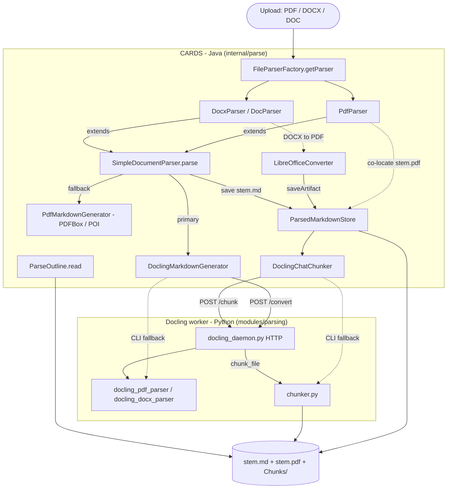
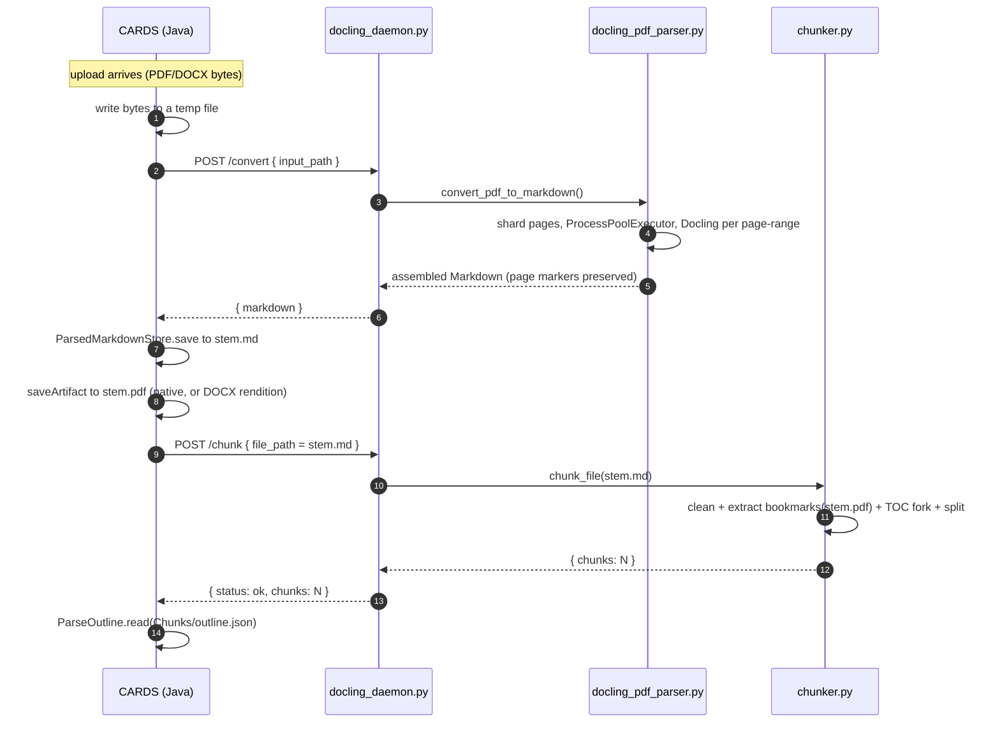
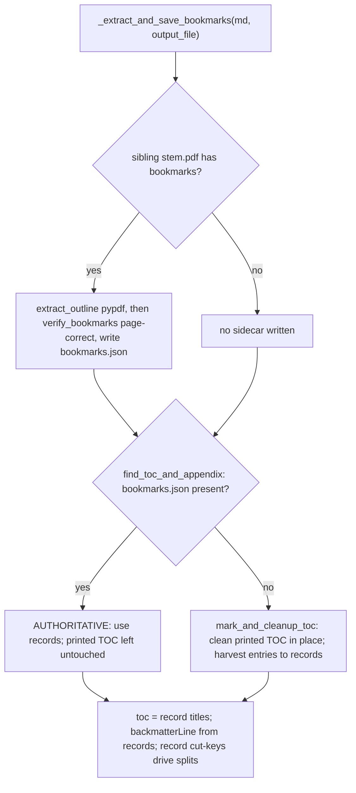

# Parsing Pipeline — How an upload becomes Markdown + chunks

Everything that happens to an uploaded proposal **up to and including chunking** — before
the LLM stages in [`PROPOSAL_PIPELINE_DESIGN.md`](PROPOSAL_PIPELINE_DESIGN.md) (Stage 0.5+).

A file (PDF / DOCX / DOC) is turned into one `<stem>.md` plus a `Chunks/` tree
(`outline.json`, and when the document is large enough `catalog.json` + `Chunk-*.md`). Two
sides cooperate: **CARDS (Java)** orchestrates and owns the files; a **Docling worker
(Python)** does the heavy Markdown generation and all the chunking/outline logic.

- **Java**: `modules/data-model/forms/impl/src/main/java/io/uhndata/cards/forms/internal/parse/`
- **Python**: `modules/parsing/src/main/python/`

---

## Big picture — who calls what



**Two rounds trips, in order:** first `/convert` (bytes → Markdown string), then `/chunk`
(the saved `.md` → chunk tree). They never share process state — Java owns the files in
between. The source PDF is co-located as `<stem>.pdf` **before** `/chunk`, which is how the
chunker later reads its bookmark outline (see [Outline](#the-outline-subsystem)).

---

## The daemon flow, step by step



If the daemon is down, Java degrades to the CLI equivalents (`docling_parser.py` for
convert, `python chunker.py <file>` for chunk). If Docling itself fails or returns too
little, `SimpleDocumentParser` falls back to the Java **PDFBox/POI** generator — which never
touches the Python worker, yet still ends up chunked the same way, because chunking keys off
the saved `.md` and its sibling PDF, not off which generator ran.

---

## Components

### Java — orchestration (owns the files)

| Class | Role |
|---|---|
| `FileParserFactory` | Route by extension → `PdfParser` / `DocxParser` / `DocParser` |
| `SimpleDocumentParser` | Shared flow: read bytes → `onDocumentBytes` hook → primary generator → fallback → `ParsedMarkdownStore.save` |
| `PdfParser` | Docling primary, PDFBox fallback; `onDocumentBytes` co-locates the uploaded **`<stem>.pdf`** via `saveArtifact` |
| `DocxParser` / `DocParser` | Docling primary, Apache POI fallback; DOC→DOCX via LibreOffice; `onDocumentBytes` renders a DOCX→PDF sibling |
| `DoclingMarkdownGenerator` | `POST /convert` to the daemon (or the Docling CLI as fallback) |
| `PdfMarkdownGenerator` / `StyledPdfTextStripper` | Java PDFBox PDF→Markdown fallback (no Python) |
| `LibreOfficeConverter` | Office→PDF rendition; `ParsedMarkdownStore.saveArtifact(..., "pdf", …)` |
| `ParsedMarkdownStore` | `save(<stem>.md)`, `saveArtifact(<stem>.<ext>)`, `clearChunks` |
| `DoclingChatChunker` | `POST /chunk` to the daemon (or `python chunker.py` as fallback) |
| `ProposalParseFolder` / `ParseOutline` | Locate `<answerDir>/<stem>.md` + `Chunks/`; read `Chunks/outline.json` |

### Python — Markdown generation + chunking (the Docling worker)

| Module | Role |
|---|---|
| `docling_daemon.py` | Long-running HTTP worker: `GET /health`, `POST /convert`, `POST /chunk`, `POST /shutdown` |
| `docling_parser.py` | CLI entry: convert one file (`--chunk` also chunks in-process) |
| `docling_pdf_parser.py` | `convert_pdf_to_markdown` — **page-sharded parallel** Docling (`ProcessPoolExecutor`, one worker per page-range, emits `<!-- page: N-->`); `convert_pdf` (CLI convert+write+chunk) |
| `docling_docx_parser.py` | DOCX → Markdown (Docling; no page markers) |
| `docling_batch_sizing.py` | Worker-count / page-batch sizing from RAM + cores |
| `docling_config.py` / `docling_error_detection.py` | Shared Docling pipeline options; parse-failure detection |
| `markdown_cleanup.py` | `clean_markdown` — strip garbage lines, collapse blanks (idempotent) |
| **`chunker.py`** | `chunk_file` / `write_chunk_files` — the single splitting module: prepare, size-gate, split, catalog + outline |
| `toc_and_appendix_detection.py` | `find_toc_and_appendix` — the outline **fork**; printed-TOC clean/harvest; `backmatter_from_records` |
| `bookmarks.py` | Outline-record helpers: `normalize_title`, `verify_bookmarks` (page verify + off-by-one correct), `resolve_record_line`, sidecar IO |
| `pdf_bookmarks.py` | `extract_outline` — flatten a PDF's embedded bookmarks (pypdf, lazy import) |
| `heading_numbering.py` | Section-numbering depth (`1.2.3`→3, `1.0`→1) for heading levels |

---

## Markdown generation

- **PDF, primary (Docling)** — `convert_pdf_to_markdown` reads the page count with `pypdf`,
  splits the pages into batches, and converts each batch in a **separate worker process**
  (`ProcessPoolExecutor`), exporting Markdown **per page** with a `<!-- page: N-->` marker
  before each. Fragments are concatenated in page order. (This per-page-range sharding is why
  bookmark/outline inference cannot run inside Docling — no single process sees the whole
  document; it runs later, in the chunker, over the assembled `.md` + sibling PDF.)
- **PDF, fallback (PDFBox)** — Java `PdfMarkdownGenerator` when Docling is unavailable or
  returns too little. No page markers.
- **DOCX** — Docling primary, Apache POI fallback. No physical pages ⇒ no `<!-- page: N-->`
  markers (so `evidence.page` is null downstream). A DOCX→PDF rendition is saved beside the
  `.md` for the bookmark path.
- **DOC** — LibreOffice converts to DOCX first, then the DOCX path.

Every generator ends the same way: Java writes `<answerDir>/<stem>.md` and co-locates
`<answerDir>/<stem>.pdf`, then calls `/chunk`.

---

## Chunking (`chunker.py`)

Pure regex/string work over the already-produced Markdown — **no LLM, no ML tokenizer, no
Docling re-convert** (milliseconds). Token counts are the cheap `len(text) // 4`.

```
chunk_file(<stem>.md)
  └─ write_chunk_files(md, output_file)
       ├─ _prepare_markdown(md, output_file)
       │    ├─ clean_markdown(md)                            # idempotent cleanup
       │    ├─ _extract_and_save_bookmarks(md, output_file)  # <stem>.pdf → bookmarks.json (verified)
       │    └─ find_toc_and_appendix(md, outline.json)       # fork → toc, backmatterLine, tokens
       │
       ├─ size gate:  tokens = len(md)//4  vs  DEFAULT_MIN_STRUCTURE_TOKENS (20000)
       │    ├─ below → Chunks/outline.json {chunked:false}; STOP (whole-doc used downstream)
       │    └─ at/above ↓
       │
       ├─ split main content at the shallowest ATX heading level
       ├─ unite consecutive sections up to DEFAULT_MAX_TOKENS (2000)
       ├─ over-budget piece → _split_oversized → _subchunk_blocks, boundaries in order:
       │       ATX sub-heading → outline-record cut → numbered stand-out → paragraph
       ├─ small text-only tail (< MIN_TAIL_TOKENS 500) folded back into the previous part
       ├─ backmatterLine..EOF → one standalone backmatter chunk (no sub-splitting)
       └─ write Chunks/ : Chunk-*.md, catalog.json, outline.json
```

Entry points (both land in `write_chunk_files`):

- `chunk_file(file_path)` — one already-parsed `.md`; used by the daemon's `POST /chunk` and
  the `python chunker.py <file>` CLI.
- `convert_pdf(..., chunk=True)` — the inline CLI path (`docling_parser.py --chunk`): parse,
  write `.md`, then chunk in the same process.

See `PROPOSAL_PIPELINE_DESIGN.md` § *Stage 0 — Chunking* for the full splitting rules and the
`catalog.json` / `outline.json` shapes.

---

## The outline subsystem

The document **outline** is a list of records `{title, level|null, page|null, verified?}`,
stored in a `bookmarks.json` sidecar and folded into `Chunks/outline.json`. It drives three
things: the `toc` array, `backmatterLine`, and record-based sub-chunk cut points. Records
come from one of two sources, decided by a **fork** in `find_toc_and_appendix`:



The producer is recorded as **`outline_source`** in `outline.json` — `pdf-bookmarks`,
`md-toc`, or `none` — and echoed in the chunk logs (`chunk_file` → `outline_source=…`),
so you can tell after the fact (or live) which path produced a document's `bookmarks.json`.

Key behaviours:

- **Verification / page-correction** (`bookmarks.verify_bookmarks`) — a bookmark often points
  one page early (header at the top of the next page). For each record the title is looked up
  on its claimed page, then N−1 and N+1; found on a neighbour ⇒ the page is **rewritten**;
  found nowhere ⇒ `verified: false`. Unpaged documents (DOCX) skip this.
- **Manual harvest** (`_entry_to_record`) — a printed-TOC entry becomes a record: title (page
  stripped), page (its trailing number), level (numbering depth via `heading_numbering`).
- **Record → line resolution** (`resolve_record_line`) — a record maps to a body line only if
  its title (normalized: casefold + alphanumerics) matches **exactly one** eligible line;
  when its page is trusted, only lines on **exactly that page** count. Fail-open: 0 or >1
  matches resolve to nothing rather than the wrong line.
- **Record cut points** (`_record_cut_keys`) — records that resolve uniquely to a non-ATX,
  non-TOC-range body line become sub-chunk boundaries — recovering section headings Docling
  emitted as plain/bold text instead of `#`.

The source PDF reaches the chunker because Java co-locates it beside the `.md`
(`ParsedMarkdownStore.saveArtifact`): DOCX→PDF renditions via `LibreOfficeConverter`, native
PDFs via `PdfParser.onDocumentBytes`.

---

## On-disk artifacts (per answer)

```
<answerDir>/
    <stem>.md                 # the parsed Markdown (Java-written)
    <stem>.pdf                # co-located source / rendition (for the bookmark outline)
    bookmarks.json            # outline records (regenerated on reconvert)
    Chunks/
        outline.json          # ALWAYS written: fileId, tokens, chunked, outline_source, toc, ranges (records stay in bookmarks.json)
        catalog.json          # only when chunked: one slim entry per Chunk-*.md
        Chunk-0.md            # content before the first boundary heading (if any)
        Chunk-1.md
        Chunk-2.1.md          # an oversized chunk split into parts
        Chunk-2.2.md
        llm_call_tracker.jsonl  # appended later by the Java LLM stages
```

`clear_prior_outputs(output_file)` (CLI reconvert) deletes the sibling `outline.json`,
`bookmarks.json`, and the whole `Chunks/` tree first, so a re-parse can never reuse stale
output — staleness is handled by **wipe-and-redo**, not versioning.

---

## Run modes

| | Daemon (production) | CLI / inline |
|---|---|---|
| Convert | Java `POST /convert` → `convert_pdf_to_markdown` (returns a string) | `docling_parser.py <file>` writes `<stem>.md` |
| Chunk | Java `POST /chunk` → `chunk_file(<stem>.md)` | `docling_parser.py --chunk`, or `python chunker.py <file>` |
| Files owned by | Java (`ParsedMarkdownStore`) | Python (writes `.md` + `Chunks/` itself) |
| Source PDF for outline | Java co-locates `<stem>.pdf` | present only if a sibling `<stem>.pdf` exists beside the `.md` |

Both modes share `chunker.py`, so the outline + chunk logic is identical; only who writes the
files and where the source PDF comes from differs.

---

## Key constants

| Constant | Value | Meaning |
|---|---|---|
| `DEFAULT_MIN_STRUCTURE_TOKENS` | 20000 | Size gate: below this the doc is left unchunked (whole-document downstream) |
| `DEFAULT_MAX_TOKENS` | 2000 | Target max tokens per chunk file before an over-budget piece is split |
| `MIN_TAIL_TOKENS` | 500 | A text-only tail smaller than this is folded back into the previous part |
| `MAX_HEADING_WORDS` / `MAX_WORD_CHARS` / `MIN_HEADING_CHARS` | 10 / 100 / 5 | Heading-validity filters (reject run-ons, garbage, `Table …` captions) |
