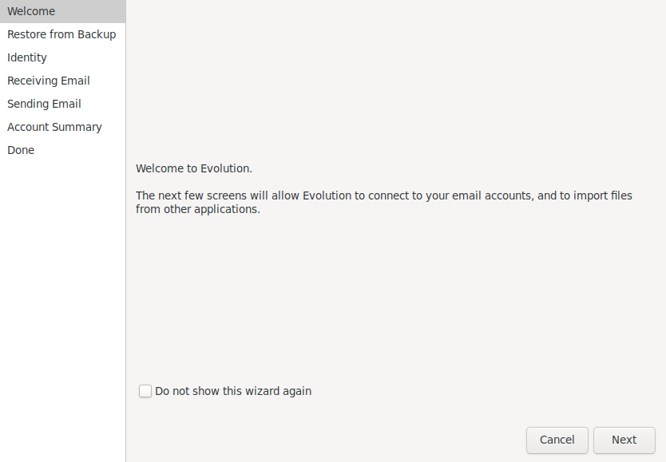
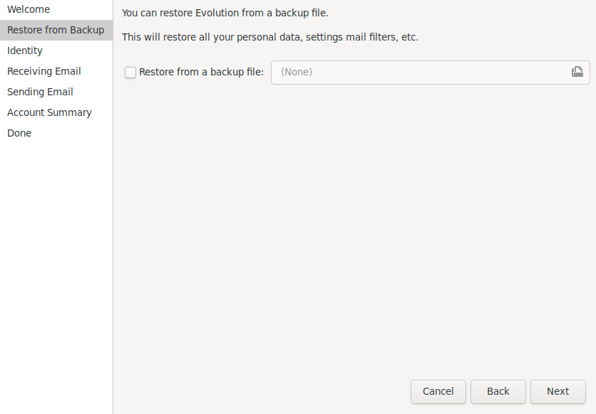
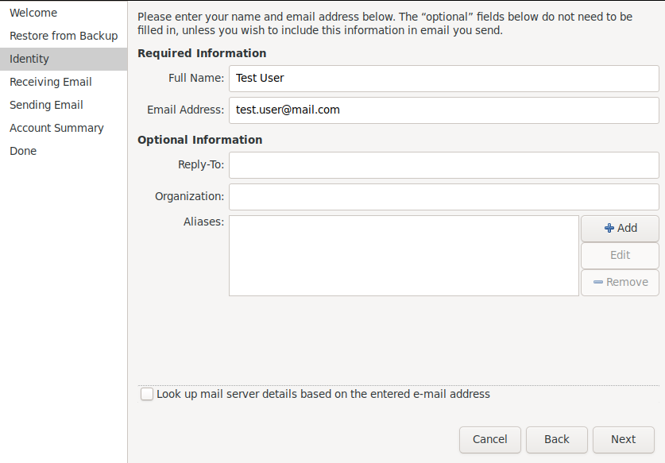
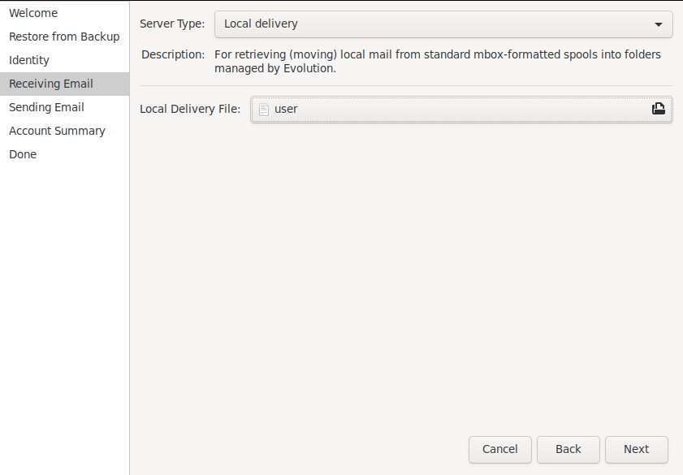
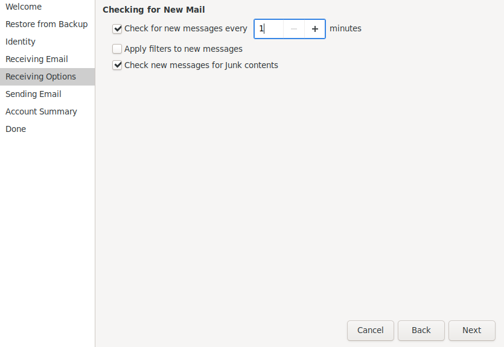
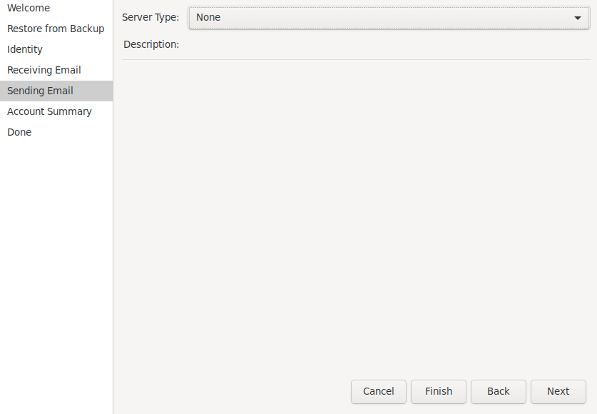
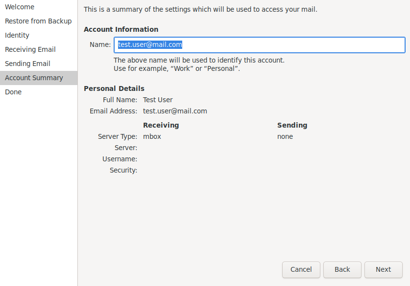
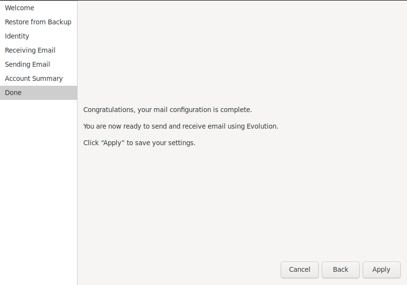
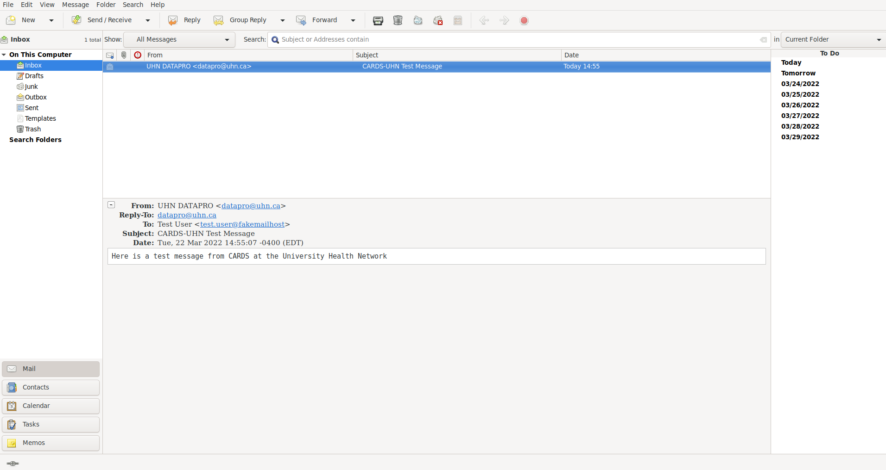

#### A Docker container for viewing emails sent by the CARDS platform

Building
--------

- Build the Docker image with

```bash
docker build -t cards/postfix-docker .
```

Using (with `./start_cards.sh`)
-------------------------------

1. Generate a self-signed SSL certificate with:

```bash
openssl req -newkey rsa:4096 -nodes -keyout path/to/output/key.pem -x509 -days 365 -out path/to/output/cert.pem
```

accept the default values.

2. Install the self-signed SSL certificate into the Java keystore:

```bash
sudo keytool -import -trustcacerts -file path/to/output/cert.pem -keystore /etc/ssl/certs/java/cacerts -keypass changeit -storepass changeit -noprompt -alias fakemailhost
```

3. If you do not have one already, install a desktop mail client capable
of reading emails in the _Mbox_ file format, such as _GNOME Evolution_:

```bash
sudo apt install evolution
```

4. Start the `cards/postfix-docker` Docker container

```bash
mkdir /path/to/test/mail/directory
./start_container.sh path/to/output/cert.pem path/to/output/key.pem /path/to/test/mail/directory
```

5. Configure the desktop mail client

5.1. Upon initial startup of _GNOME Evolution_, you will be prompted for
configuration.


5.2. Skip restoring from a backup.


5.3. Create a fake user and do not look up mail server details based on
the entered email address.


5.4. Set the _Server Type_ to _Local delivery_ and set the
_Local Delivery File_ to your user file under
`/path/to/test/mail/directory`.


5.5. Check for new messages every _one_ minute.


5.6. Configuration for sending emails from _GNOME Evolution_ is not
required.


5.7. Verify account creation settings.


5.8. Finish.


6. Start CARDS with emailing enabled (such as in the `cards4proms` project):

```bash
NIGHTLY_NOTIFICATIONS_SCHEDULE='0 * * * * ? *' SLING_COMMONS_CRYPTO_PASSWORD=password CARDS_HOST_AND_PORT='localhost:8080' ./start_cards.sh --project cards4proms --dev -V emailnotifications.smtps.checkserveridentity=false
```

7. Send a test email
  - Visit `http://localhost:8080/` and login as `admin` : `admin`.
  - Visit `http://localhost:8080/content.emailtest?fromEmail=datapro@uhn.ca&fromName=UHN%20DATAPRO&toEmail=test.user@fakemailhost&toName=Test%20User`

8. After synchronizing the desktop mail client with the Mbox file, you
should see the new test message.



Stopping
--------

To stop the running `cards/postfix-docker` Docker container:
- Get its name
```bash
$ docker ps
CONTAINER ID        IMAGE                  COMMAND                  CREATED             STATUS              PORTS                                             NAMES
491a142e92a4        cards/postfix-docker   "/bin/sh -c /docker_…"   14 minutes ago      Up 14 minutes       127.0.0.1:8025->25/tcp, 127.0.0.1:8465->465/tcp   goofy_kilby
```
- Then stop it
```bash
$ docker stop goofy_kilby
```

Using (with Docker Compose)
---------------------------

1. Clean up any previously used Docker Compose configuration

```bash
cd compose-cluster
./cleanup.sh
```

2. Build a new Docker Compose YAML configuration

```bash
python3 generate_compose_yaml.py --dev_docker_image --oak_filesystem --cards_project cards4proms --server_address localhost:8080 --smtps --smtps_test_container --smtps_test_mail_path ~/path/to/mail/directory/
```

3. Build the Docker Compose configuration

```bash
docker-compose build
```

4. Start the Docker Compose configuration

```bash
docker-compose up -d
```

5. Configure your desktop mail client by following the instructions
under _step 5_ of the _Using (with `./start_cards.sh`)_ section.

6. Send a test email
  - Visit `http://localhost:8080/` and login as `admin` : `admin`.
  - Visit `http://localhost:8080/content.emailtest?fromEmail=datapro@uhn.ca&fromName=UHN%20DATAPRO&toEmail=test.user@fakemailhost&toName=Test%20User`

7. After synchronizing the desktop mail client with the Mbox file, you
should see the new test message.
