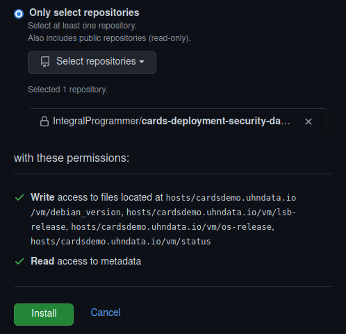

# Security Scanning

### Setup

#### Repository / Database Setup

1. Create a new `cards-deployment-security-database` _private_ GitHub repository.

2. In the `cards-deployment-security-database` repository, create the following _empty_ files:
  - `hosts/cardsdemo.uhndata.io/vm/lsb-release`
  - `hosts/cardsdemo.uhndata.io/vm/os-release`
  - `hosts/cardsdemo.uhndata.io/vm/status`
  - `hosts/cardsdemo.uhndata/io/vm/debian_version`
  - `hosts/cardsdemo.uhndata/io/vm/kernel_version`
  - `reports/cardsdemo.uhndata.io.md`

3. In the following steps (4,5,6,7), replace `cardsdemo.uhndata.io` with
the hostname of your deployment and repeat for each deployment that you
wish to setup security scanning for.

4. In the `cards-deployment-security-database` repository, add the file
`hosts/cardsdemo.uhndata.io/docker/cards`, and populate it with the
sha256 fingerprint value of the CARDS image that is deployed on that
server. For testing purposes, you can use
`sha256:2c8ad4982875d56ca8869faf569fab09bd0b2f954c3d2c1c6ffedf20b85e9d94`
which is the fingerprint value for `ghcr.io/integralprogrammer/cards:0.9.5`.

5. You will need to create a `cards-apk-listing` Docker image which is a
reduced Docker image that contains only the files listing the Alpine
Linux packages that are installed on the CARDS Docker image that is
deployed in production. You can do this with the
`build_package_listing_docker_image.sh` script or, for testing purposes,
you can use `ghcr.io/integralprogrammer/cards-apk-listing`.

6. Create the `docker/<DEPLOYED_IMAGE_SHA256_FINGERPRINT>/yarn.lock`
(eg. `docker/2c8ad4982875d56ca8869faf569fab09bd0b2f954c3d2c1c6ffedf20b85e9d94/yarn.lock`)
file and populate it with the contents of the `yarn.lock` file of the
CARDS build that is being used in deployment. For testing purposes, you
can upload the `yarn.lock` file from `aggregated-frontend/src/main/frontend/yarn.lock`.

7. Generate a `maven.json` file by running
`./list_maven_packages_in_docker_image.sh ghcr.io/integralprogrammer/cards:0.9.5 ~/maven.json`
and upload the `maven.json` file to the `cards-deployment-security-database`
repository as `docker/<DEPLOYED_IMAGE_SHA256_FINGERPRINT>/maven.json`
(eg. `docker/2c8ad4982875d56ca8869faf569fab09bd0b2f954c3d2c1c6ffedf20b85e9d94/maven.json`)

#### GitHub API Setup

1. For each VM that we wish to include in the security scan, repeat the
following steps (2,3,4,5,6,7,8).

2. Visit `https://github.com/settings/apps/new`.

3. Configure the application as follows:
  - **Github App name**: `hostname-os-pkgs` (eg. `cardsdemo.uhndata.io-os-pkgs`)
  - **Homepage URL**: Your GitHub profile (eg. `https://github.com/IntegralProgrammer`)
  - Disable **Expire user authorization tokens**
  - Disable the **Webhook**
  - **Repository permissions / Single file**: `Access: Read and write` for
    - `hosts/cardsdemo.uhndata.io/vm/lsb-release`
    - `hosts/cardsdemo.uhndata.io/vm/os-release`
    - `hosts/cardsdemo.uhndata.io/vm/status`
    - `hosts/cardsdemo.uhndata/io/vm/debian_version`
    - `hosts/cardsdemo.uhndata/io/vm/kernel_version`
  - **Where can this GitHub App be installed?**: `Only on this account`

4. Click **Create GitHub App**

5. Click **Generate a private key** and save the generated `.pem` file.

6. Make note of the _App ID_.

7. Click **Install App** and install to **Only select repositories**
selecting the `cards-deployment-security-database` repository.



8. Make note of the _Installation ID_ from the URL in the browser's
address bar (ie. `https://github.com/settings/installations/<INSTALLATION ID IS HERE>`).

9. Next, we will need to configure a GitHub App that has read/write access
to the contents of the `cards-deployment-security-database` repository.
To do so, visit `https://github.com/settings/apps/new` and configure the
application as follows:
  - **Github App name**: `cards-security-scanner`
  - **Homepage URL**: Your GitHub profile (eg. `https://github.com/IntegralProgrammer`)
  - Disable **Expire user authorization tokens**
  - Disable the **Webhook**
  - **Repository permissions / Contents**: `Access: Read and write`
  - **Where can this GitHub App be installed?**: `Only on this account`

10. Click **Create GitHub App**

11. Click **Generate a private key** and save the generated `.pem` file.

12. Make note of the _App ID_.

13. Click **Install App** and install to **Only select repositories**
selecting the `cards-deployment-security-database` repository.

14. Make note of the _Installation ID_ from the URL in the browser's
address bar (ie. `https://github.com/settings/installations/<INSTALLATION ID IS HERE>`).

### Usage

1. On the VM that is hosting the CARDS deployment, enter the
`Utilities/SecurityScanning` directory and run the following commands:

```bash
export GITHUB_API_APP_ID=<App ID from GitHub API Setup step 6>
export GITHUB_API_INSTALLATION_ID=<Installation ID from GitHub API Setup step 8>
export GITHUB_API_PRIVATE_KEY=$(cat /path/to/pem/file/downloaded/in/GitHub/API/Setup/step/5)
export GITHUB_REPOSITORY=<github organization or username / cards-deployment-security-database (eg. IntegralProgrammer/cards-deployment-security-database)>
python3 github_publish_os_package_list.py --deployment_hostname (hostname of this deployment, eg. cardsdemo.uhndata.io)
python3 github_publish_os_kernel_version.py --deployment_hostname (hostname of this deployment, eg. cardsdemo.uhndata.io)
```

For testing purposes, you may wish to copy the
`Utilities/SecurityScanning` directory into an Ubuntu 22.04 Docker
container, configure the `GITHUB_API_APP_ID`, `GITHUB_API_INSTALLATION_ID`,
`GITHUB_API_PRIVATE_KEY`, `GITHUB_REPOSITORY` environment variables in
the container,
`apt install python3 python3-jwt python3-distro python3-requests` and
run the `github_publish_os_package_list.py` and
`github_publish_os_kernel_version.py` scripts from within the container.

If all has worked properly, the files,
`hosts/cardsdemo.uhndata.io/vm/lsb-release`,
`hosts/cardsdemo.uhndata.io/vm/os-release`,
`hosts/cardsdemo.uhndata.io/vm/status`,
`hosts/cardsdemo.uhndata.io/vm/kernel_version` should be updated on the
`cards-deployment-security-database` repository.

2. To perform a security scan, on your development / testing machine,
enter the `Utilities/SecurityScanning` directory and run the following
commands:

```bash
export GITHUB_API_APP_ID=<App ID from GitHub API Setup step 12>
export GITHUB_API_INSTALLATION_ID=<Installation ID from GitHub API Setup step 14>
export GITHUB_API_PRIVATE_KEY=$(cat /path/to/pem/file/downloaded/in/GitHub/API/Setup/step/11)
export GITHUB_REPOSITORY=<github organization or username / cards-deployment-security-database (eg. IntegralProgrammer/cards-deployment-security-database)>
export SLACK_INCOMING_WEBHOOK_URL=<URL of an Incoming Slack Webhook where security alerts should be displayed>
./slack_vulnerability_report_job.sh cardsdemo.uhndata.io <name of cards-apk-listing Docker image OR ghcr.io/integralprogrammer/cards-apk-listing>
```

Once the security scan completes, a message summarizing the results of
the security scan will be posted on Slack and the full report will be
made available on the `cards-deployment-security-database` repository
under `reports/hostname.md` (eg. `reports/cardsdemo.uhndata.io.md`).
